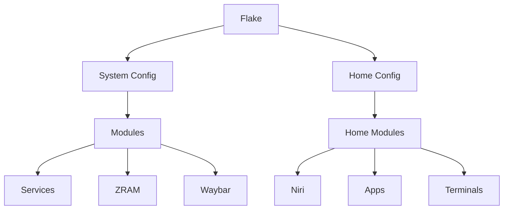

# NyxOS Configuration Map

This document provides a structured map of the NyxOS repository, showing where major files and modules live, the build-time vs runtime boundary, and quick guides for implementation.

## Repository Structure

```
.
├── AGENTS.md                  # Agent guidelines and operational rules
├── Justfile                   # Primary developer interface
├── README.md                 # Project overview
├── docs/                     # Documentation
│   ├── ASSERTIONS.md         # Runtime invariants and contracts
│   └── CONFIG_MAP.md         # This file
└── NixOS/                    # NixOS configuration
    ├── modules/              # Reusable NixOS modules
    │   ├── home/             # Home Manager configurations
    │   │   ├── apps/         # Application configurations
    │   │   ├── terminals/    # Terminal configurations
    │   │   ├── niri-shared.nix # Niri compositor shared config
    │   │   ├── options.nix    # Home Manager options
    │   │   └── shells.nix     # Shell configurations
    │   ├── noctalia/         # Noctalia-specific modules
    │   ├── waybar/           # Waybar configurations
    │   │   ├── dynamic-island.nix # Dynamic island config
    │   │   ├── scripts.nix    # Waybar scripts
    │   │   └── default.nix   # Main Waybar config
    │   ├── zram-*            # ZRAM configurations
    │   └── ...
    ├── configuration.nix     # Main system configuration
    ├── directory structure.mmf # Mind map of directory structure
    ├── flake.nix             # Flake definition
    └── home-ashy.nix         # Home Manager configuration
```

## Build-Time vs Runtime Boundary

### Build-Time Components

- **Flake Definition** (`NixOS/flake.nix`): Defines inputs, outputs, and system configurations
- **Modules** (`NixOS/modules/`): Reusable NixOS modules evaluated at build time
- **System Configuration** (`NixOS/configuration.nix`): Main system configuration
- **Home Manager Config** (`NixOS/home-ashy.nix`): User environment configuration

### Runtime Components

- **Services**: Systemd services defined in modules
- **Waybar**: Status bar with dynamic island
- **Niri**: Wayland compositor
- **ZRAM**: Memory compression configurations
- **Applications**: User applications configured via Home Manager

## Quick Implementation Guide

### Adding a New Module

1. **Location**: Create in `NixOS/modules/` with appropriate subdirectory
2. **Structure**: Follow existing module patterns (options + config)
3. **Integration**: Import in `configuration.nix` or relevant parent module
4. **Documentation**: Update this map and add to `ASSERTIONS.md`

### Adding a New Service

1. **Module**: Create in `NixOS/modules/` (e.g., `services/my-service.nix`)
2. **Configuration**: Define service options and implementation
3. **Enable**: Add to system configuration via module imports
4. **Assertions**: Add runtime checks to `ASSERTIONS.md`

### Adding Home Manager Configuration

1. **Location**: `NixOS/modules/home/` with appropriate category
2. **Structure**: Follow Home Manager module conventions
3. **Integration**: Import in `home-ashy.nix`
4. **Testing**: Verify with `home-manager switch`

## Kernel Tuning Reference

- Sysctl tuning is consolidated under **Advanced Memory & Kernel Tuning** in `NixOS/configuration.nix`
- Add or adjust kernel and VM sysctls in that single block to avoid conflicting definitions

## Evolving Runtime Component Map

### Current Runtime Components

| Component | Type | Location | Responsibility |
|-----------|------|----------|----------------|
| Waybar | Service | `modules/waybar/` | Status bar with dynamic island |
| Niri | Service | `modules/home/niri-shared.nix` | Wayland compositor |
| ZRAM | Module | `modules/zram-*` | Memory compression |
| Node Exporter | Service | `configuration.nix` | Prometheus metrics on port 9100 (systemd/btrfs/textfile collectors) |
| Home Apps | Config | `modules/home/apps/` | Application configurations |
| Terminals | Config | `modules/home/terminals/` | Terminal emulator configs |

### Component Relationships



## Change Implementation Flow

1. **Identify Component Type**: Module, Service, or Configuration
2. **Locate Appropriate Directory**: Use this map as guide
3. **Follow Existing Patterns**: Match style and structure of similar components
4. **Update Documentation**: Modify this map and assertions
5. **Test**: Run `just ci` to validate changes

## Future Component Planning

- **Container Runtime**: For server profile
- **Gaming Layer**: Steam, Wine, etc.
- **Backup System**: Borg or similar
- **Monitoring**: Prometheus/Grafana stack
